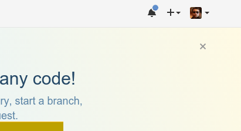
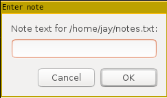
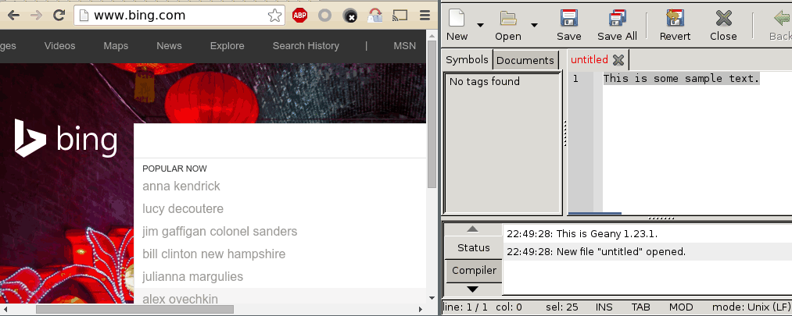

# scrappyscripts
A bunch of desktop automation scripts

## functions.bash
Helper functions used by the other scripts in this package.

## gifrecord.bash
Takes a "video" of a region and makes a GIF of it.
- Very useful for quickly demonstrating software bugs.

## screenshot.bash
Takes a screenshot of a selected region, saves it to a file, then places it on the clipboard
for pasting into Hangouts, GMail, and others.
- Useful for quickly pasting screenshots into MIME-aware applications

## guinote.sh
Simple GUI popup that appends the entered line into a text file.
- Useful for logging your progress during the work day

## simplerun.sh
Implements a simple GUI popup to run commands (a la `gmrun`).
- Useful to avoid dependency installation for a relatively simple function

## typepaste.sh
"Types" out the contents of the X selection into the active window.
- Useful for applications where normal copy-paste is not effective, especially Dell iDRAC, HP iLO, KVM service consoles
- Also useful to paste scripts and other data into remote sessions like RDP
- Also useful for web sites that fuck with paste functionality (password fields for example)

